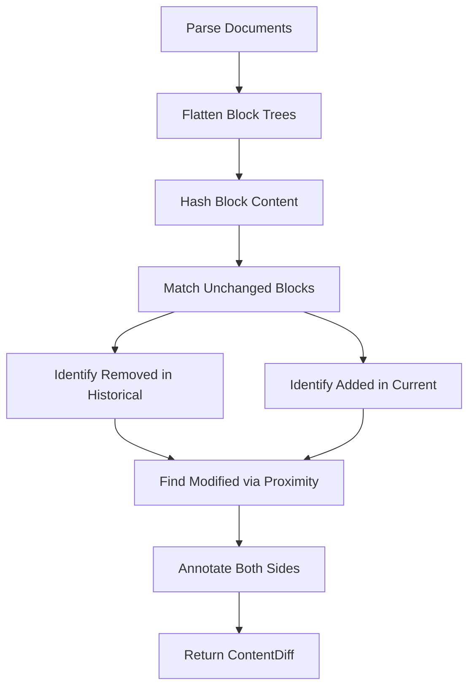

# BlockNote Diff Package

> **Package Proposal**: Extracting block-level diff utilities for BlockNote documents into a standalone npm package.

## Executive Summary

Extract `blocknote-diff` from Skelenote as a standalone npm package that provides **block-level diffing for BlockNote documents**. This fills a gap in the BlockNote ecosystem — there's no official or community solution for comparing document versions.

---

## Why This Matters

### The Problem
Apps with version history (think Notion's history or Google Docs' "See version history") need to show what changed between versions. BlockNote doesn't ship with this capability.

### Current Solutions
- **None** — developers either skip the feature or build custom solutions
- Generic JSON diff libraries don't understand block semantics

### Our Solution
A purpose-built differ that understands BlockNote's document structure:
- Detects added, removed, modified, and unchanged blocks
- Content-based matching (ignores block ID changes)
- Property diffing for metadata changes
- Summary statistics (added: 3, removed: 1, modified: 2)

---

## Package Overview

### Name Options
| Name | Pros | Cons |
|------|------|------|
| `blocknote-diff` | Clear, matches ecosystem naming | May seem official |
| `@skelenote/blocknote-diff` | Clear provenance | Scoped, longer |
| `bn-diff` | Short | Unclear meaning |

**Recommendation**: `blocknote-diff` (clear, discoverable)

---

## API Surface

```typescript
// Core Types
export type DiffStatus = 'added' | 'removed' | 'modified' | 'unchanged';

export interface BlockDiff {
  id: string;
  type: string;
  status: DiffStatus;
  block: Block;
}

export interface ContentDiff {
  historical: BlockDiff[];  // Left side (old)
  current: BlockDiff[];     // Right side (new)
  summary: DiffSummary;
}

export interface DiffSummary {
  added: number;
  removed: number;
  modified: number;
  unchanged: number;
}

export interface PropertyDiff {
  key: string;
  status: DiffStatus;
  oldValue?: unknown;
  newValue?: unknown;
}

// Core Functions
export function computeContentDiff(
  historicalContent: string | null,
  currentContent: string | null
): ContentDiff;

export function computePropertyDiff(
  historicalProps: Record<string, unknown>,
  currentProps: Record<string, unknown>
): PropertyDiff[];

export function hasContentChanges(
  historicalContent: string | null,
  currentContent: string | null
): boolean;

// Utilities
export function extractInlineText(content: unknown[]): string;
export function flattenBlocks(blocks: Block[]): Block[];
```

---

## Source Files to Extract

| Current Path | Package Path | Notes |
|--------------|--------------|-------|
| [block-diff.ts](file:///Users/jordanstella/GitHub/skelenote/src/lib/diff/block-diff.ts) | `src/index.ts` | Core diffing logic |
| [index.ts](file:///Users/jordanstella/GitHub/skelenote/src/lib/diff/index.ts) | — | Just re-exports, not needed |

---

## Changes Required

### 1. Remove Skelenote Dependencies

Current import:
```typescript
import { deserializeBlockNoteDocument } from '@/lib/editor';
```

Replace with inline implementation or optional peer dependency:
```typescript
// Option A: Inline (no dependencies)
function parseContent(content: string): Block[] {
  try {
    return JSON.parse(content);
  } catch {
    return [];
  }
}

// Option B: Peer dependency on @blocknote/core
import { Block } from '@blocknote/core';
```

### 2. Type Definitions

Export proper TypeScript types that work standalone:
```typescript
export interface Block {
  id?: string;
  type: string;
  props?: Record<string, unknown>;
  content?: InlineContent[];
  children?: Block[];
}

export interface InlineContent {
  type: string;
  text?: string;
  styles?: Record<string, unknown>;
}
```

### 3. Add React Component (Optional)

For React apps, provide a ready-to-use diff viewer:
```typescript
// blocknote-diff/react
export function DiffViewer({ 
  historical, 
  current,
  renderBlock?: (block: Block, status: DiffStatus) => ReactNode
}: DiffViewerProps): JSX.Element;
```

---

## Algorithm Overview

The diff algorithm uses **content-based matching**:



**Key insight**: Block IDs may change between versions (e.g., after import/export). We match blocks by their **text content hash**, not ID.

---

## Example Usage

### Basic Diff
```typescript
import { computeContentDiff } from 'blocknote-diff';

const historical = '[{"type":"paragraph","content":[{"type":"text","text":"Hello"}]}]';
const current = '[{"type":"paragraph","content":[{"type":"text","text":"Hello World"}]}]';

const diff = computeContentDiff(historical, current);
// diff.summary: { added: 0, removed: 0, modified: 1, unchanged: 0 }
// diff.current[0].status: 'modified'
```

### Property Diff
```typescript
import { computePropertyDiff } from 'blocknote-diff';

const oldProps = { title: 'Draft', status: 'pending' };
const newProps = { title: 'Final', status: 'pending', priority: 'high' };

const diff = computePropertyDiff(oldProps, newProps);
// [
//   { key: 'title', status: 'modified', oldValue: 'Draft', newValue: 'Final' },
//   { key: 'status', status: 'unchanged' },
//   { key: 'priority', status: 'added', newValue: 'high' }
// ]
```

### Quick Check
```typescript
import { hasContentChanges } from 'blocknote-diff';

if (hasContentChanges(savedVersion, currentVersion)) {
  showUnsavedChangesWarning();
}
```

---

## Package Structure

```
blocknote-diff/
├── package.json
├── tsconfig.json
├── src/
│   ├── index.ts          # Main exports
│   ├── types.ts          # Type definitions
│   ├── diff.ts           # Core diff algorithm
│   ├── text.ts           # Text extraction utilities
│   └── properties.ts     # Property diffing
├── react/                # Optional React bindings
│   ├── package.json
│   ├── DiffViewer.tsx
│   └── index.ts
├── tests/
│   ├── diff.test.ts
│   └── fixtures/
└── README.md
```

---

## Dependencies

```json
{
  "name": "blocknote-diff",
  "version": "0.1.0",
  "type": "module",
  "main": "dist/index.js",
  "types": "dist/index.d.ts",
  "peerDependencies": {
    "@blocknote/core": ">=0.12.0"
  },
  "peerDependenciesMeta": {
    "@blocknote/core": {
      "optional": true
    }
  },
  "devDependencies": {
    "typescript": "^5.0.0",
    "vitest": "^1.0.0"
  }
}
```

---

## Testing Strategy

### Port Existing Tests
The current implementation doesn't have dedicated tests — this is an opportunity to add them.

### Test Cases to Cover

| Category | Test Case |
|----------|-----------|
| **Basic** | Empty documents |
| **Basic** | Identical documents |
| **Added** | New block at end |
| **Added** | New block at beginning |
| **Added** | New block in middle |
| **Removed** | Block removed from end |
| **Removed** | Block removed from middle |
| **Modified** | Text content changed |
| **Modified** | Block type changed |
| **Complex** | Multiple changes in one doc |
| **Nested** | Changes in nested blocks |
| **Edge** | Null/undefined inputs |
| **Edge** | Malformed JSON |
| **Edge** | Very large documents (performance) |

### Test Commands

```bash
# Run all tests
pnpm test

# Run with coverage
pnpm test:coverage

# Watch mode during development
pnpm test:watch
```

---

## Verification Plan

### Automated Tests
1. **Unit tests** for all exported functions
2. **Snapshot tests** for complex diff scenarios
3. **Performance benchmarks** for large documents (1000+ blocks)

### Manual Verification
Since this is a new standalone package (not modifying existing code), manual testing will focus on:

1. **npm publish dry-run**: Verify package contents are correct
   ```bash
   npm pack --dry-run
   ```

2. **Integration test**: Create a test app that imports the package
   ```bash
   cd /tmp && mkdir test-app && cd test-app
   npm init -y
   npm install ../path/to/blocknote-diff
   node -e "const d = require('blocknote-diff'); console.log(d.computeContentDiff('[]','[]'))"
   ```

---

## Competitive Landscape

| Package | Approach | BlockNote-aware? |
|---------|----------|------------------|
| `diff` | Line-by-line text diff | ❌ |
| `deep-diff` | Generic object diff | ❌ |
| `jsondiffpatch` | JSON structure diff | ❌ |
| **`blocknote-diff`** | Block-level semantic diff | ✅ |

---

## Target Users

1. **BlockNote users** building note-taking or document apps
2. **Version history implementers** (like Notion's history feature)
3. **Collaboration tools** showing real-time changes
4. **Audit trail systems** logging document modifications

---

## Launch Plan

### Phase 1: Core Package (Week 1)
- [ ] Set up repository with TypeScript config
- [ ] Extract and refactor source code
- [ ] Write comprehensive test suite
- [ ] Basic README with examples

### Phase 2: Polish (Week 2)
- [ ] Add React component (`blocknote-diff/react`)
- [ ] API documentation
- [ ] Performance optimization and benchmarks
- [ ] GitHub Actions CI

### Phase 3: Release (Week 3)
- [ ] Publish to npm
- [ ] Announce in BlockNote Discord
- [ ] Blog post with use cases
- [ ] Consider PR to BlockNote docs/ecosystem page

---

## Open Questions

1. **React component scope?**
   - Minimal (just wraps diff data) vs. full-featured (syntax highlighting, side-by-side view)
   - Recommendation: Start minimal, expand based on feedback

2. **BlockNote version compatibility?**
   - BlockNote is pre-1.0 and evolving
   - Strategy: Use loose peer dependency, test against multiple versions

3. **Inline content diffing?**
   - Current: Block-level only
   - Future: Character-level diff within blocks (more complex)

---

## Success Metrics

| Metric | Target (6 months) |
|--------|-------------------|
| npm weekly downloads | 500+ |
| GitHub stars | 50+ |
| BlockNote ecosystem link | Listed in BlockNote docs |
| Issues/PRs from community | 5+ |

---

## License

**MIT** — matches BlockNote's license, maximizes adoption.
