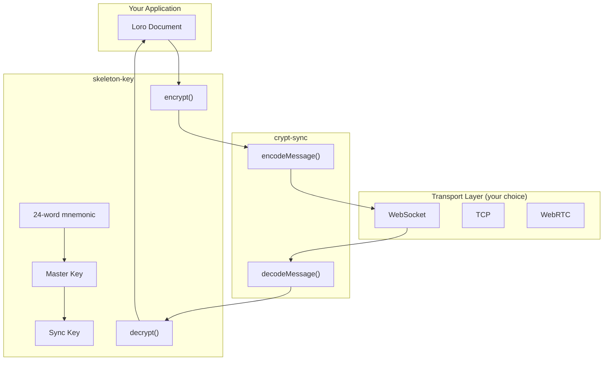

# Zero-Knowledge Sync Toolkit

> **Package Proposal**: Extracting `skeleton-key` and `crypt-sync` from Skelenote into reusable open-source packages.

## Executive Summary

This proposal outlines extracting two tightly-related modules from Skelenote into standalone, reusable packages that any local-first application can use for **end-to-end encrypted CRDT synchronization**:

1. **`skeleton-key`** (Rust crate) — BIP39 mnemonic key management with HKDF key derivation
2. **`crypt-sync`** (Rust crate + npm package) — Binary wire protocol for syncing Loro CRDTs

Together, they form a **"zero-knowledge sync toolkit"** — a complete solution for apps that want encrypted P2P/cloud sync without ever exposing plaintext to servers.

**Organization**: `github.com/skeletor-js`

---

## Why This Matters

### The Problem
Local-first apps face a common challenge: syncing data between devices without trusting the relay server. Most developers either:
- Roll their own encryption (risky, time-consuming)
- Use third-party sync services (vendor lock-in, potential privacy concerns)
- Skip encryption entirely (unacceptable for sensitive data)

### The Solution
These packages provide a **batteries-included, opinionated solution**:
- User-friendly key backup via 24-word mnemonic phrase
- Industry-standard cryptography (XChaCha20-Poly1305, HKDF-SHA256)
- Works with Loro CRDTs (but protocol layer is generic)
- Same patterns used in production by Skelenote

---

## Package 1: `skeleton-key`

### Overview
A Rust crate for generating, storing, and deriving cryptographic keys from a user-friendly mnemonic phrase.

### API Surface

```rust
// Key Generation
pub fn generate_mnemonic() -> Result<String, Error>;
pub fn validate_mnemonic(mnemonic: &str) -> bool;

// Key Derivation
pub fn mnemonic_to_master_key(mnemonic: &str) -> Result<Zeroizing<[u8; 32]>, Error>;
pub fn derive_key(master_key: &[u8; 32], domain: &str, info: &str) -> Zeroizing<[u8; 32]>;
pub fn derive_user_id(master_key: &[u8; 32]) -> String;

// Encryption (XChaCha20-Poly1305)
pub fn encrypt(key: &[u8; 32], plaintext: &[u8]) -> Result<Vec<u8>, Error>;
pub fn decrypt(key: &[u8; 32], ciphertext: &[u8]) -> Result<Vec<u8>, Error>;

// Optional: Secure Storage (feature-gated)
#[cfg(feature = "keychain")]
pub struct KeychainStorage { ... }
```

### Source Files to Extract

| Current Path | Notes |
|--------------|-------|
| [keys.rs](../../../src-tauri/src/crypto/keys.rs) | Core key generation and derivation |
| [encryption.rs](../../../src-tauri/src/crypto/encryption.rs) | XChaCha20-Poly1305 encryption |
| [error.rs](../../../src-tauri/src/crypto/error.rs) | Error types |
| [stronghold.rs](../../../src-tauri/src/crypto/stronghold.rs) | Optional — keychain integration |

### Changes Required

1. **Remove Skelenote-specific constants**
   - Replace `skelenote-sync-v1` domain with parameterized input
   - Make `KEYCHAIN_SERVICE` configurable

2. **Abstract storage layer**
   - Extract keychain integration behind a trait: `trait SecureStorage`
   - Feature-gate OS keychain support: `#[cfg(feature = "keychain")]`

3. **Add WASM support** (optional, future)
   - Conditionally compile without OS-specific features

### Dependencies

```toml
[dependencies]
bip39 = "2.0"
chacha20poly1305 = "0.10"
hkdf = "0.12"
sha2 = "0.10"
rand = "0.8"
zeroize = { version = "1.8", features = ["derive"] }

[features]
keychain = ["keyring"]
```

### Example Usage

```rust
use skeleton_key::{generate_mnemonic, mnemonic_to_master_key, derive_key, encrypt, decrypt};

// Generate a new 24-word mnemonic
let mnemonic = generate_mnemonic()?;
println!("Backup these words: {}", mnemonic);

// Derive master key
let master_key = mnemonic_to_master_key(&mnemonic)?;

// Derive a purpose-specific key
let sync_key = derive_key(&master_key, "my-app-sync-v1", "encryption");

// Encrypt data
let plaintext = b"Hello, encrypted world!";
let ciphertext = encrypt(&sync_key, plaintext)?;
let decrypted = decrypt(&sync_key, &ciphertext)?;
assert_eq!(decrypted, plaintext);
```

---

## Package 2: `crypt-sync`

### Overview
A binary wire protocol for syncing Loro CRDT updates, shipped as both a Rust crate and npm package with identical APIs.

The name `crypt-sync` captures both meanings: **crypt** (skeleton theme) and **crypto** (encryption).

### Message Types

| Type | Code | Description |
|------|------|-------------|
| `HELLO` | `0x01` | Client handshake with device ID, protocol version |
| `UPDATE` | `0x02` | Loro CRDT update bytes (encrypted) |
| `SNAPSHOT_REQUEST` | `0x03` | Request full state snapshot |
| `SNAPSHOT` | `0x04` | Full Loro snapshot (encrypted) |
| `ACK` | `0x05` | Acknowledgment with session count |
| `PING` / `PONG` | `0x06-07` | Keep-alive |
| `CATCH_UP` | `0x08` | Request historical updates |
| `HISTORY` | `0x09` | Batch of historical updates |
| `COMPACT` | `0x0a` | Client-initiated compaction |

### Wire Format

```
[type: 1 byte][length: 4 bytes LE][payload: N bytes]
```

### Source Files to Extract

**Rust:**
| Current Path | Notes |
|--------------|-------|
| [protocol.rs](../../../src-tauri/src/network/protocol.rs) | Core protocol encoding/decoding |

**TypeScript:**
| Current Path | Notes |
|--------------|-------|
| [protocol.ts](../../../src/lib/sync/protocol.ts) | Client-side protocol mirror |

### API Surface (Rust)

```rust
pub enum MessageType {
    Hello, Update, SnapshotRequest, Snapshot, Ack,
    Ping, Pong, CatchUp, History, Compact,
}

pub fn encode_message(msg_type: MessageType, payload: &[u8]) -> Vec<u8>;
pub fn decode_message(data: &[u8]) -> Result<(Message, usize), ProtocolError>;

pub struct HelloPayload { pub device_id: String, pub protocol_version: u8, ... }
pub struct AckPayload { pub session_count: u32, ... }
```

### API Surface (TypeScript)

```typescript
export const MessageType = {
  HELLO: 0x01,
  UPDATE: 0x02,
  // ...
} as const;

export function encodeMessage(type: MessageTypeValue, payload: Uint8Array): Uint8Array;
export function decodeMessage(data: ArrayBuffer): { type: MessageTypeValue; payload: Uint8Array };
export function encodeJsonPayload<T>(data: T): Uint8Array;
export function decodeJsonPayload<T>(payload: Uint8Array): T;
```

### Changes Required

1. **Remove device management messages**
   - Device registry, revocation, rename are Skelenote-specific
   - These add complexity and are tightly coupled to Skelenote's device model
   - Apps can build their own device management layer on top

2. **Make protocol version configurable**
   - Currently hardcoded; should be caller-provided

3. **Add extensible message type ranges**
   - Reserve `0x01-0x0f` for core, `0x10-0x7f` for extensions, `0x80+` for app-specific

### Package Structure

```
crypt-sync/
├── Cargo.toml           # Rust crate
├── src/
│   ├── lib.rs
│   ├── message.rs       # MessageType enum and encoding
│   ├── payload.rs       # Payload structs
│   └── error.rs
├── package.json         # npm package
├── ts/
│   ├── index.ts
│   ├── protocol.ts
│   └── types.ts
└── README.md
```

---

## Combined Architecture



---

## Target Audience

1. **Local-first app developers** using Loro or similar CRDTs
2. **Privacy-focused products** needing zero-knowledge sync
3. **Indie developers** who want encryption without cryptography expertise
4. **Teams migrating from Notion/Obsidian** to self-hosted solutions

---

## Naming

| Package | Name | Rationale |
|---------|------|-----------|  
| Encryption | `skeleton-key` | Memorable, matches Skelenote's terminology |
| Protocol | `crypt-sync` | Double meaning: crypt (skeleton) + crypto (encryption) |

---

## Versioning Strategy

- Start at `0.1.0` (pre-1.0 signals API may evolve)
- Commit to semver after initial feedback period
- Protocol version embedded in HELLO message for forward compatibility

---

## License Recommendation

**MIT OR Apache-2.0** (dual-license, standard for Rust ecosystem)

This maximizes adoption while allowing commercial use, matching Loro's own licensing.

---

## Success Metrics

1. **Adoption**: 100+ GitHub stars within 6 months
2. **Integration**: 3+ projects using in production within 1 year
3. **Community**: At least 2 external contributors

---

## Risks & Mitigations

| Risk | Mitigation |
|------|------------|
| Breaking protocol changes | Embed version in HELLO, support N-1 version |
| Security vulnerabilities | Security audit before 1.0, clear responsible disclosure policy |
| Low adoption | Strong documentation, example apps, blog post announcement |
| Scope creep | Strict "what's in 1.0" boundary — encryption + protocol only, no device management |

---

## Implementation Phases

### Phase 1: Extraction (Week 1-2)
- [ ] Create new repositories
- [ ] Extract and refactor source files
- [ ] Write unit tests (port existing + add new)
- [ ] Basic README and documentation

### Phase 2: Polish (Week 3-4)
- [ ] API review and refinement
- [ ] Example applications (Rust CLI, Node.js script)
- [ ] CI/CD setup (GitHub Actions)
- [ ] Publish to crates.io and npm

### Phase 3: Announce (Week 5)
- [ ] Blog post / dev.to article
- [ ] Hacker News / Reddit post
- [ ] Discord/Twitter announcement
- [ ] Skelenote docs updated to reference packages

---

## Open Questions

1. **WASM support priority?**
   - Would enable browser-only apps (no Tauri/Electron)
   - Requires conditional compilation work

2. **Relay server reference implementation?**
   - Would demonstrate the full loop
   - Significant additional scope — maybe Phase 2

---

## Repository Structure

```
github.com/skeletor-js/
├── skeleton-key/              # Rust crate for key management
├── crypt-sync/                # Rust + TypeScript protocol
└── zero-knowledge-sync-demo/  # Demo app showing both
```

---

## Next Steps

1. **Get feedback** on this proposal
2. **Finalize package names** and repository locations
3. **Begin extraction** with `skeleton-key` (simpler, fewer dependencies)
4. **Add `loro-sync-protocol`** once skeleton-key is stable
